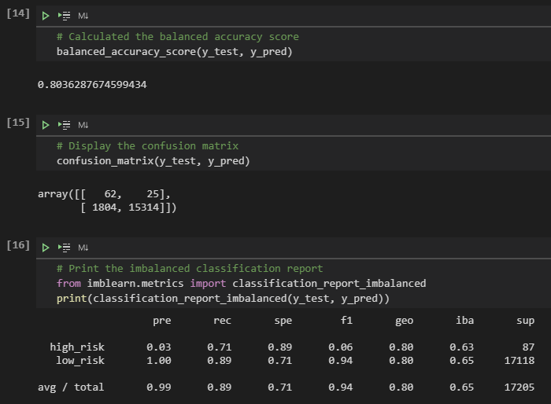

# Credit Risk Analysis
## Overview
Credit risk is an unbalanced classification problem. There are many factors that are not necessarily accounted for, so we will use machine learning to try and compensate to determine the most accurate and precise model in predicting credit risk. Several machine learning modesl will be ran and compared and we will help decide which model is the most ideal for determining credit risk on a number of factors.

## Results
#### 1. Naive Random Oversampling models:

- The balanced accuracy score is 0.65, the balanced precision score is 0.99, and the balanced recall score is 0.66.
- The precision score is 0.01 and 1.00 for high risk and low risk respectively. While the recall score is 0.64 and 0.66 for high risk and low risk respectively.

#### 2. SMOTE Oversampling model
- 

- The balance accuracy score is 0.65, the balanced precision score is 0.99 and the balanced recall score is 0.66.
- The precision score is 0.01 and 1.00 for high risk and low risk respectively. While the recall score is 0.64 and 0.66 for high risk and low risk respectively.

#### 3. Undersampling model

- The balance accuracy score is 0.52, the balanced precision score is 0.99 and the balanced recall score is 0.41.
- The precision score is 0.01 and 1.00 for high risk and low risk respectively. While the recall score is 0.63 and 0.41 for high risk and low risk respectively.

#### 4. SMOTEENN (the combination of Over and Under Sampling) model

- The balance accuracy score is 0.64, the balanced precision score is 0.99 and the balanced recall score is 0.57.
- The precision score is 0.01 and 1.00 for high risk and low risk respectively. While the recall score is 0.70 and 0.57 for high risk and low risk respectively.

#### 5. Balanced Random Forest Classifier

- The balance accuracy score is 0.80, the balanced precision score is 0.99 and the balanced recall score is 0.89.
- The precision score is 0.03 and 1.00 for high risk and low risk respectively. While the recall score is 0.71 and 0.89 for high risk and low risk respectively.

#### 6. Easy Ensemble AdaBoost Classifier

- The balance accuracy score is 0.93, the balanced precision score is 0.99 and the balanced recall score is 0.94.
- The precision score is 0.08 and 1.00 for high risk and low risk respectively. While the recall score is 0.91 and 0.94 for high risk and low risk respectively.

## Summary
Due to the low precision on high risk loans for all models, it is difficult to recommend any of the models exclusively for that factor. The Easy Ensemble has a higher balanced accuracy and recall score when compared to other models, as well as the highest precision score for high risk loans. While it is not the optimal choice, the Easy Ensemble AdaBoost Classifier outshines its competitors run in this analysis by a pretty significant margin. 